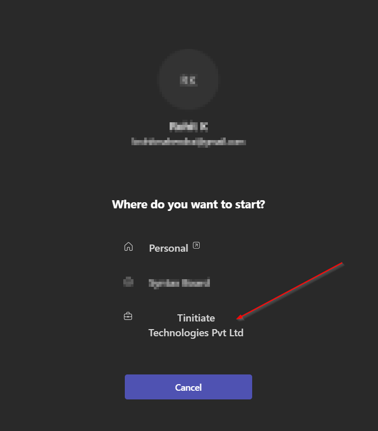
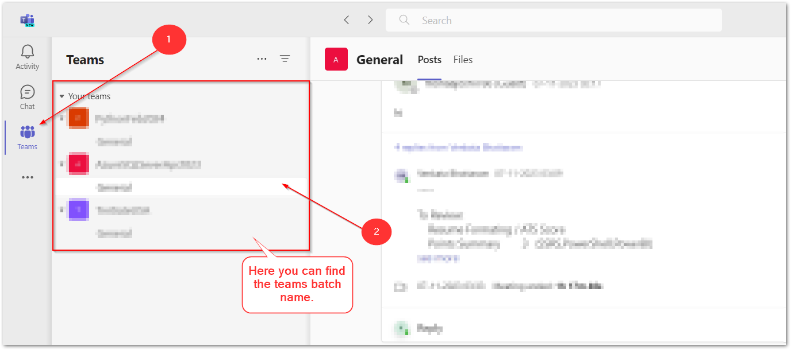
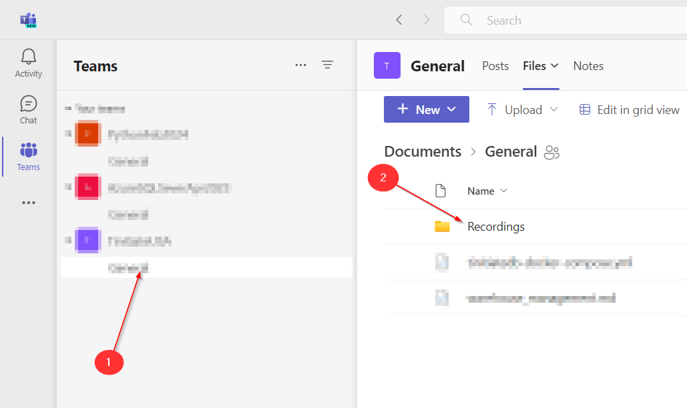

# Joining Microsoft Teams
&copy; TINITIATE.COM

## Using Teams Work or School Version
* Open the app on your system.

* SignUp / Login with the **SAME EMAIL ID** you have provided, **DO NOT USE OTHER EMAIL ID**
* Open the Teams App
* You will get a prompt like below, select **Tinitiate Technologies Pvt Ltd**.

* Goto teams tab and click on the batch name

* Click on general under the batch name and in the right section goto files tab.

* There you can find the recordings and also join the team meetings.

## Video to demonstrate to join to Teams Meeting

## Join the meeting as a guest
* Open the Teams app. Make sure you open the Teams for **work or school** and NOT PERSONAL .  
Click **Join a meeting**.
* Enter the meeting ID and click **Join**.
* If you are asked to sign in, click **Sign in as a guest**.
* Enter your name and email address, and click **Join**.

## Video to demonstrate to join to Teams Meeting
